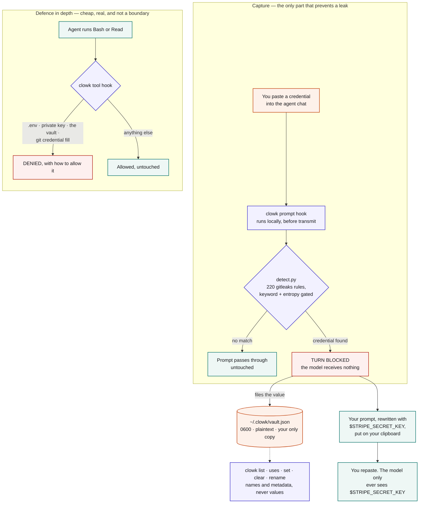

# clowk

[](https://github.com/Aniumbott/clowk/actions/workflows/ci.yml)

Catches credentials you paste into an AI coding agent's chat **before they reach the model**,
files them locally, and records where each one came from.

Works with Claude Code, Codex, and Gemini CLI. Claude Code is the host it has been proven live on;
`NOTES.md` records what is verified per host and what is not.

## What it does

You paste an API key into the chat. A local hook scans the prompt before it is transmitted. If it
finds a credential, the turn is **blocked** — the model receives nothing, and on Claude Code the
blocked prompt is not written to the transcript either (verified there; not checked on the other
two hosts) — the value is filed in `~/.clowk/vault.json`, and you get your prompt back with the
credential replaced by `$STRIPE_SECRET_KEY`, put on your clipboard if a clipboard tool is
available. Repaste and carry on.

One message is filed under at most 20 names. A prompt with more hits than that is a pasted log
tripping the shape-only rules rather than a credential paste, so the rest are still redacted and
the turn is still blocked, but they are not filed — the block message says how many, and suggests
resending with `unclowk` if none of them are credentials.

Each entry records the working directory of the session that pasted it, and every `clowk get` is
added to that credential's `used by` list — so `clowk uses` tells you both where a credential came
from and what has actually consumed it. A credential nothing has used yet reads
`(nothing recorded yet)`.

Connection strings are handled as a unit: paste `postgresql://user:pw@host/db` and the whole URI is
filed as `$DATABASE_URL`, not just the password, so the host and database name do not travel to the
model either. Placeholder passwords (`password`, `changeme`) and values that are already references
(`$DB_PASS`) are left alone.

A second hook denies the easy accidental credential reads: `.env`, private keys, the vault itself,
and the handful of commands that print a live token from the OS keychain in one line. It denies
*running* those, not mentioning them — a path or a phrase in a commit message, an `echo`, or a grep
pattern passes; a path only counts as a read when something that reads files is running it. The
`Read` tool's own path check needs no such heuristic and stays strict. Its deny is shaped per
host, like the block: a decision object on Claude Code, exit 2 with the reason on stderr on Codex
and Gemini CLI. Only Claude Code's tool-deny shape is verified — see `NOTES.md`.

## How it works

Orange is where a real credential exists. Teal is a reference only — `$STRIPE_SECRET_KEY`, worth
nothing on its own. There are exactly two orange boxes, and the agent touches neither.



Blocking is the whole mechanism. No host can rewrite a submitted prompt — verified on all three —
so there is no silent swap, only block-and-repaste, which is why the clipboard step matters.

The diagram shows what clowk does, not what it cannot do. Read the next section for that;
`clowk-architecture.svg` is the fuller version, and `DESIGN.md` explains why the design is this
shape and what was built and removed getting here.

## What it is not

**clowk is not a security boundary.** It runs as the same OS user as the agent, so whatever clowk
can read, `cat` can read. It stops accidents — a pasted key reaching the model, a credential in a
command's output, a careless `cat` — and it does not stop an agent that is deliberately trying to
extract a value.

Specifically, it does **not** protect against:

- **Hook failure.** Every host fails open: if the hook crashes or times out, your prompt is
  transmitted. clowk raises the bar; it cannot guarantee interception.
- **Files you `@`-mention.** The host reads those, not clowk.
- **Grep**, which shows file contents to the model. The deny hook is registered on `Bash` and
  `Read` only, so anything else that reads a file goes around it.
- **Unrecognised formats.** Detection is 220 gitleaks rules plus one rule of clowk's own for
  credential-shaped tokens standing alone. A shape none of them knows goes straight through.
- **Hex-only secrets with no keyword near them.** A 64-character hex string is a sha256 digest and
  a 256-bit HMAC secret at the same time; nothing about the token separates them. Reporting them
  standing alone would block `git show <sha>`, so clowk does not. With a keyword nearby
  (`webhook_secret = <hex>`) they are caught. This is a deliberate trade, measured, not an oversight.
- **128-bit hex secrets, about 18% of the time, even with a keyword.** Hex has 16 symbols, so a
  32-character hex string caps out at 4.0 bits of entropy against the 3.5 floor gitleaks sets for
  its generic rule, and measured over 2000 samples 17.8% fall under it. The floor is left at
  gitleaks' value rather than re-tuned for one key size. 256-bit hex and larger are unaffected.
- **Partially matched credentials.** A rule matches a span, and only that span is replaced. If your
  credential is longer than the pattern that caught it — a vendor variant, a key with a suffix the
  rule does not know — the remainder stays in the rewritten prompt, while the block message still
  says clowk stopped a credential. Overlapping rules are handled (the longest match wins, so a short
  rule cannot leave the tail of a longer key behind), but a format no rule covers in full is not.

A real boundary needs a separate OS user, a container with clowk outside it, or a code-signed
binary holding an OS keychain ACL. None of those is what this tool is.

## Install

Requires Python 3.8 or newer. No pip installs — standard library only.

On Windows use `python` (or `py`) wherever this README writes `python3`; there is no
`python3` on a stock Windows install. `clowk install` records the absolute path of the
interpreter you ran it with, so the registered hook does not depend on any name being on
PATH — but if you later move or replace that interpreter, re-run `install`.

```bash
git clone https://github.com/Aniumbott/clowk.git
cd clowk
python3 clowk/cli.py install              # Claude Code
python3 clowk/cli.py install codex        # Codex
python3 clowk/cli.py install gemini-cli   # Gemini CLI
```

Then restart the agent. `install` merges into your existing settings, backs the file up first, and
refuses to touch it if it is not valid UTF-8 JSON. `uninstall` removes only clowk's own entries,
and leaves everything else exactly as you wrote it, accented characters included. Both keep the
file's existing permissions; a settings file clowk has to create is owner-only from the start.

The registered hook command holds this clone's absolute path, so if you move or rename the
directory, re-run `install` from the new location (and `uninstall` from the old one first).

On Codex, hooks require trust: run `/hooks` and approve clowk. Because trust is hash-based, every
clowk update will ask again.

### The `/clowk` slash command

`clowk install` writes `~/.claude/commands/clowk.md`, so `/clowk` works with no further steps. It
generates that file rather than copying the one in `commands/` — that copy resolves
`${CLAUDE_PLUGIN_ROOT}`, which is only set for plugin commands. If you already have your own
`/clowk` command, clowk refuses to overwrite it and says so.

#### Installing as a plugin instead — optional

`clowk install` registers hooks and nothing else. `/clowk` is a Claude Code plugin command, so it
takes its own install, independent of the one above. Inside Claude Code, with `<clone>` the absolute
path to this directory:

```
/plugin marketplace add <clone>
/plugin install clowk@clowk-dev
```

Point the marketplace at this clone rather than at a git URL: a URL marketplace clones a second
copy, so the slash command would end up running different code from the hooks you just registered.
Both copies read the same vault, so nothing breaks immediately — but after you pull, the hooks are
new and `/clowk` is still the snapshot the plugin installed, and they can disagree.

If you do use the URL, it needs the `.git` suffix — `https://github.com/Aniumbott/clowk/` fails
with `repository not found`, `https://github.com/Aniumbott/clowk.git` works. To move an existing
URL install onto your clone: `/plugin marketplace remove clowk-dev`, then add the local path.
The plugin declares no hooks of its own (see `NOTES.md`), so it cannot double-register anything.
Note that a plugin command is always namespaced `<plugin>:<command>`, so the plugin's copy is
reachable as `/clowk:clowk` rather than `/clowk` — which is why `install` writes the user-level file
as well. Installing the plugin is entirely optional.

## Use

There is no installed `clowk` binary — the CLI is `python3 <clone>/clowk/cli.py`. Alias it:

```bash
alias clowk='python3 ~/clowk/clowk/cli.py'
```

```
clowk list                 stored credentials — names and metadata, never values
clowk add NAME             type a credential at the terminal instead of pasting it in chat
clowk set NAME             replace a value after rotating it upstream
clowk clear NAME           forget one
clowk rename OLD NEW       rename one
clowk uses [NAME]          where a credential was caught, and its (unfilled) used-by list
clowk allow PATTERN        stop denying one of clowk's rules — a filename, a suffix or a command
                           phrase, as the deny message prints it, not a full path
clowk deny PATTERN         undo an allow, putting the rule back
clowk install [HOST]       register clowk's hooks; uninstall removes them
```

`add` and `set` never take the value as an argument — that would put it in your shell history.

## Using a captured credential

A captured value is **not** in your agent's environment — `echo $DATABASE_URL` prints nothing, and
that is the point. To let a command use one, substitute it at the point of use:

```bash
psql "$(clowk get DATABASE_URL)"
curl -H "Authorization: Bearer $(clowk get STRIPE_SECRET_KEY)" https://api.stripe.com/v1/charges
```

The shell runs `clowk get`, captures the value, and hands it straight to the command as an argument.
Your command stays your command — nothing wraps it, so the host's own permission rules still match
what you actually ran, and nothing spawns a shell around it.

**`clowk get` is the only command that prints a credential, and it is guarded.** Used any other way
the value lands in the transcript, so clowk's tool hook denies a bare `clowk get`, a substitution fed
to `echo`/`cat`/`printf`, a pipe, a redirect, and capture into a shell variable. The guard lives in
the hook rather than in `clowk get` because a process cannot tell whether it was
command-substituted — measured, not assumed: the invoking shell's command line is not visible to it
in an agent harness.

`clowk install` also copies `skills/clowk/SKILL.md` to `~/.claude/skills/`, and a session's **first**
block ends with a short pointer to it — so the rule arrives in the same message as the `$NAME` it
applies to. Later blocks in the same session omit it: the agent has already read the skill, and the
pointer is pure cost once it has landed. A host whose payload carries no session id gets it every
time, because omitting it costs more than repeating it.

Running a credential through `clowk get` is also what fills the `used by` list, so `clowk uses` tells
you what a rotation would actually touch.

## Storage

`~/.clowk/vault.json`, mode 0600 on POSIX (on Windows it relies on user-profile ACLs). Set
`CLOWK_VAULT` to move it, and `CLOWK_DENY` to move the deny hook's config.

**Plaintext, deliberately.** Encryption cannot help here: clowk runs as the same user as the agent,
so any key would have to be reachable by that same user. This is the same posture as
`~/.aws/credentials`, `~/.npmrc`, `~/.docker/config.json` and an unencrypted `id_rsa`. Because the
file is plain JSON, reading it is also your export and backup path — there is nothing to lock you
out of your own credentials.

If a hand-edit leaves the file unparseable, clowk refuses rather than guessing: every command
prints the path and stops, and nothing is overwritten, so fixing the JSON brings everything back.
A capture during that window still blocks the turn and still redacts the value — it just tells you
the value was not filed.

## False positives

129 of the 220 rules match on shape rather than a literal vendor prefix, and clowk's own
standalone-token rule matches on shape alone, so a legitimate prompt can be blocked. (That count is deliberately conservative: a pinned format with no trailing separator,
like `AKIA…`, is counted as shape-only too, and only the value half of a rule counts — a vendor
name in the rule's keyword list says nothing about the value's shape.) Every block message tells
you how to bypass
(`unclowk`), and shape-only matches are flagged in `clowk list` so they are easy to purge with
`clowk clear NAME`.

## Development

No dependencies, so no setup step:

```bash
python3 -m unittest discover -s tests        # 268 tests, ~2s
python3 -m unittest discover -s tests -v     # per-test names
```

CI runs the same suite on Python 3.8 through 3.13 across Linux, macOS and Windows, plus three
checks the suite cannot make on its own: that no third-party import has crept in, that the prompt
hook run end to end leaks the raw value into neither stream on any of the three hosts, and that
install merges into a settings file it did not write and uninstall restores it byte for byte.

`tests/test_docs.py` checks this README against the code, so a claim here that stops being true
fails the suite.

The layout: `detect.py` scans (rules + confidence tiers), `vault.py` stores, `hosts.py` adapts each
host's payload and block protocol, `hook_prompt.py` is the pre-transmit guard, `hook_pretool.py` the
tool deny, `deny.py` its rules, `install.py` registers hooks, `cli.py` is the human surface.
`DESIGN.md` explains why the design is this shape and what was tried and removed; `NOTES.md` records
the per-host platform findings.

## Updating the ruleset

`clowk/rules.json` is generated by `build_rules.py` from the **vendored** copy of
`clowk/gitleaks.toml`. Re-running it alone reproduces a byte-identical file — to pick up new
patterns, replace `clowk/gitleaks.toml` with a newer one from
[gitleaks](https://github.com/gitleaks/gitleaks) first, then re-run.

## Contributing

Adding a host takes a `hosts.py` entry, an `install.py` target, and a verified answer to: what is the
pre-transmit event called, can it block, and can it rewrite the prompt? `clowk debug-payload` dumps
what a host actually sends. Please do not add a host on inference — `NOTES.md` marks what is verified
and what is not, and that distinction is load-bearing.

## Attribution

Secret patterns derive from [gitleaks](https://github.com/gitleaks/gitleaks) (MIT License).

## License

MIT — see `LICENSE`.
