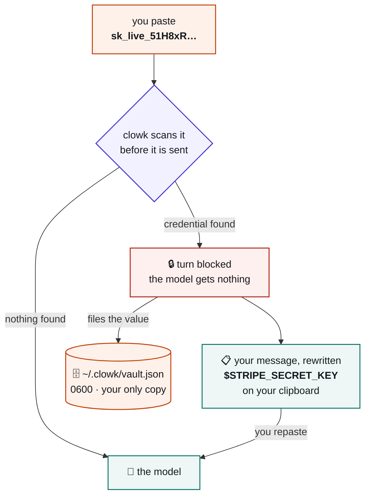
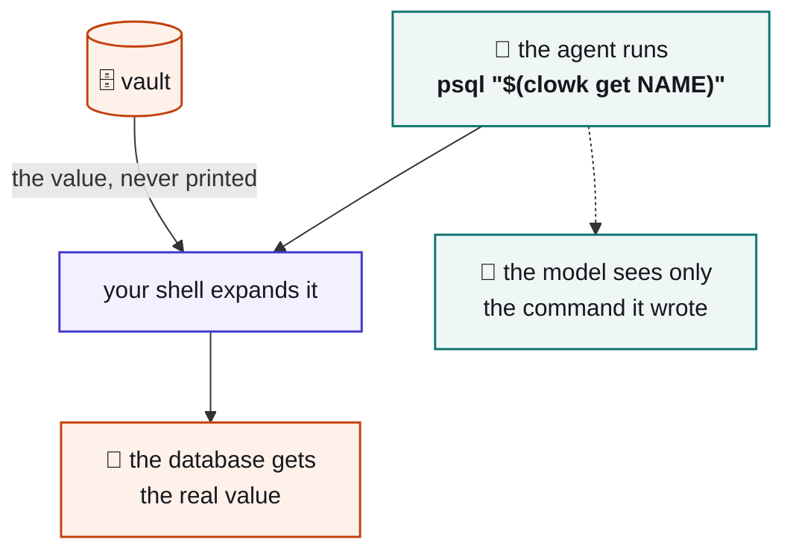
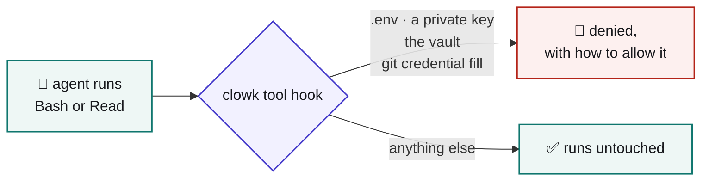

<div align="center">

<picture>
  <source media="(prefers-color-scheme: dark)" srcset="https://raw.githubusercontent.com/Aniumbott/clowk/main/assets/logo-dark.svg">
  
</picture>

# clowk

**Catches credentials you paste into an agent chat before they reach the model.**

[](https://github.com/Aniumbott/clowk/actions/workflows/ci.yml)
[](https://www.python.org/downloads/)
[](https://github.com/Aniumbott/clowk/blob/main/LICENSE)

</div>

A pre-transmit hook for agent CLIs. It scans your prompt before it is sent; if it finds a
credential, the turn is blocked, the value is filed locally under a name, and your message is
returned on your clipboard with a `$NAME` reference in place of the secret.

```
👀 clowk caught a credential before it reached the model.

   💾  $STRIPE_SECRET_KEY

📋 Paste this — already on your clipboard:

   rotate this key for me: $STRIPE_SECRET_KEY

   [assistant: $NAME is a credential clowk holds. Never print it.
    Use $(clowk get NAME) — see the clowk skill.]

🤔 Not a credential? Resend starting with  unclowk
```

Claude Code, Codex and Gemini CLI. Python 3.8+, standard library only. No daemon, nothing to sign up
for, and **neither hook ever touches the network** — the only command that does is `clowk update`,
which runs your package manager or `git pull` when you ask it to.

## Contents

| | |
|---|---|
| [What it is good for](#what-it-is-good-for) | Beyond catching a mistake |
| [Quick start](#quick-start) | Install, update, uninstall |
| [How it works](#how-it-works) | The capture path and what gets detected |
| [Using a credential](#using-a-credential) | `$(clowk get NAME)` and the guard around it |
| [Commands](#commands) | The full CLI |
| [The tool-deny hook](#the-tool-deny-hook) | For leaks you did not type |
| [Architecture](#architecture) | Everything on one diagram |
| [Limitations](#limitations) | What this does not protect you from |
| [Configuration](#configuration) | Paths and environment variables |
| [False positives](#false-positives) | Why they happen and how to clear them |
| [Contributing](#contributing) | How to help |
| [Development](#development) | Tests, layout, the ruleset |

## What it is good for

Catching a paste is how most people meet clowk, but it is the smaller half. The same three
primitives — a local store, a `$NAME` reference that is worthless on its own, and a guard that only
permits command substitution — make clowk a **credential supply route for agents** rather than only a
net under your mistakes.

Nothing here needs a credential to have been leaked first. `clowk add NAME` takes a value at the
terminal, so it never enters a chat at all.

| Use it for | How |
|---|---|
| **Credentials that survive across sessions** | `clowk add` each one once, then name clowk in your `CLAUDE.md`. Every future session can reach `$(clowk get DATABASE_URL)` without a value ever entering a prompt, a transcript, or the model. |
| **Keeping keys out of the agent's environment** | A captured value is not exported. `env`, `printenv` and a leaked `.env` dump cannot reveal it — unlike `export STRIPE_KEY=…` in your shell profile, which every agent session inherits and any `env` call prints straight into the transcript. |
| **Runbooks and docs you can commit** | `psql "$(clowk get DATABASE_URL)"` is safe to write into a committed runbook, `CLAUDE.md`, or a README. The reference is worth nothing to whoever clones it. |
| **One store across several agent CLIs** | Claude Code, Codex and Gemini CLI all read the same `~/.clowk/vault.json`. One credential store instead of three sets of environment variables. |
| **Rotation without archaeology** | `clowk uses NAME` reports where a credential was captured and every directory that has drawn on it since, so a rotation is a list to work through rather than a guess. |
| **Noticing a bad habit** | Re-catches are counted. When `clowk list` says a key has been caught five times, that key belongs in `clowk add` and out of your muscle memory. |
| **Agent-initiated leaks** | The tool-deny hook refuses `cat .env`, `git credential fill`, private keys and the vault itself — the ways a credential reaches a transcript without you typing anything. |
| **Pasting logs and dumps** | Credentials inside a pasted log are redacted before the model sees them, whether or not they get filed. |

**What it is not good for.** Screen sharing and recordings: Claude Code prints the raw prompt back to
your terminal under clowk's message, so the value is on screen even though the model never got it.
It is also not a CI or deployment secret manager — there is no daemon, nothing on the network in the
capture path, and the vault is a local file belonging to one user.

## Quick start

Pick whichever suits the machine — there is no single command that works everywhere, because
`pip install --user` is refused outright on Homebrew, Debian, Ubuntu and Fedora Pythons
([PEP 668](https://peps.python.org/pep-0668/)):

```bash
uv tool install clowk                                          # if you have uv
pipx install clowk                                             # what Homebrew and apt suggest
git clone https://github.com/Aniumbott/clowk.git && cd clowk    # no prerequisites at all
```

Then, whichever route you took, one command:

```bash
clowk setup          # from a clone: python3 clowk/cli.py setup
```

It finds the agent CLIs on your machine, asks which to set up, registers the hooks, installs the
skill — and then **fires a test credential through the hook it just registered** to confirm the turn
is really blocked and the value leaks into neither stream. A host it cannot prove is reported as
unproven rather than given a tick.

For dotfiles, a Dockerfile or CI, it runs unattended:

```bash
clowk setup --hosts claude-code,codex --yes
clowk setup --dry-run                     # print the plan, write nothing
```

If `~/.local/bin` is not on your `PATH`, `install` says so and prints the line to add.

> **Do not substitute a shell alias.** Aliases exist only in interactive shells, and the caller that
> matters is the non-interactive Bash your agent runs. There `$(clowk get NAME)` expands to nothing,
> your command runs *without* the credential, and the error looks like a bad key rather than a
> missing tool.

`install` merges into your existing settings, backs them up first, and refuses a settings file that
is not valid UTF-8 JSON. `uninstall` removes only what clowk wrote, byte for byte, and never touches
the vault. Hooks and launcher hold absolute paths to this clone and to the interpreter you ran
`install` with, so nothing depends on `PATH` — but move the clone and you re-run `install`.

On Windows use `python` or `py`; there is no `python3` on a stock install. On Codex, hooks need
trust: run `/hooks` and approve clowk. Trust is hash-based, so every update asks again.

### Updating

```bash
clowk update           # --check to look without changing anything
```

**Why this is a command and not just `git pull`.** The hooks and launcher hold absolute paths, so they
pick up new code immediately — but the skill is *copied* into each host's skills directory and
`/clowk` is *generated* into `~/.claude/commands/`, so neither moves until install runs again. New
code, old skill, and nothing on screen saying so. `clowk update` does both halves for every host you
have registered.

For a clone it runs `git pull --ff-only` itself, refusing if you have modified tracked files.
Untracked files are ignored, since they cannot make the pull fail. For a package install it prints
the right command for the manager it can see — `pipx upgrade`, `uv tool upgrade` or `pip install
--upgrade` — rather than guessing, because guessing wrong can leave a half-replaced package and on
Windows `pip install -U` against a running package can fail on locked files.

<details>
<summary><code>/clowk</code> and the optional plugin</summary>

`clowk install` writes `~/.claude/commands/clowk.md`, so `/clowk` works with no further steps, and
copies the skill to `~/.claude/skills/clowk/` so the agent knows what a `$NAME` is. Without that
skill an agent reads `$DATABASE_URL` as an ordinary empty variable and asks you to paste the real one
again.

The plugin is therefore optional. It delivers the skill and `/clowk:clowk` and nothing else — it
declares no hooks, so the guard still comes from `clowk install`.

```
/plugin marketplace add Aniumbott/clowk
/plugin install clowk@clowk
```

**Either source makes a second copy.** `/plugin install` caches the whole tree under
`~/.claude/plugins/cache/clowk/clowk/<version>/`, pinned to the commit you installed at. The cache
key is `plugin.json`'s version, which does not change when the source does, so `/clowk:clowk` runs
that snapshot until you bump the version and run `/plugin marketplace update clowk`. Both copies read
the same vault, so nothing breaks at once — they drift.

</details>

## How it works



**Why block instead of swapping the value in silently?** No host can rewrite a prompt you have
already submitted — verified on all three. A hook may block or allow, and that is the entire API. So
block-and-repaste is the only available shape, and the clipboard is what keeps it tolerable.

### Detection

221 [gitleaks](https://github.com/gitleaks/gitleaks) rules plus three of clowk's own: one for
credential-shaped tokens standing alone, and one for each connection-string dialect.

- **Connection strings are captured whole.** `postgresql://user:pw@host/db` files as
  `$DATABASE_URL`, so your hostname and database name do not travel either. The `key=value;` dialect
  used by Microsoft SDKs and ODBC drivers gets the same treatment — an Azure storage string files as
  `$AZURE_STORAGE_CONNECTION_STRING` rather than having its `AccountKey` swapped while
  `AccountName=prodstore` rides along.
- **Placeholders are left alone.** `changeme`, `<your-account-key>`, and values that are already
  references such as `$DB_PASS`.
- **At most 20 names per message.** More hits than that is a pasted log, not a paste of credentials.
  The rest are still redacted and the turn is still blocked; they are just not filed.

### Naming

The `$NAME` comes from whatever identified the credential:

| Case | Name |
|---|---|
| A vendor rule matched | its own name — `$STRIPE_SECRET_KEY` |
| Caught only because of a label you typed | that label — `secret access key = …` → `$SECRET_ACCESS_KEY` |
| No label anywhere near it | `$SECRET` |
| Name taken, same value | reused; the directory is added to the ledger |
| Name taken, different value | suffixed — `$NAME_2`; nothing is overwritten |

## Using a credential

A captured value is **not** in your agent's environment — `echo $DATABASE_URL` prints nothing, by
design. Substitute it at the point of use:

```bash
psql "$(clowk get DATABASE_URL)"
curl -H "Authorization: Bearer $(clowk get STRIPE_SECRET_KEY)" https://api.stripe.com/v1/charges
```



The shell hands the value to the command as an argument. Nothing wraps your command, so your host's
own permission rules still match what you actually ran.

**`clowk get` is the only thing that prints a credential, so it is guarded.** A second hook refuses a
bare `clowk get`, a substitution piped into `echo`/`cat`/`printf`, a redirect, and capture into a
shell variable — each of those would put the value back in your transcript. The check lives in the
hook rather than in `clowk get` because a process cannot tell whether it was command-substituted.

Your agent learns this from a skill `setup` installs, pointed at from a session's first block so the
rule arrives with the `$NAME` it governs. What each host gets:

| Host | Hooks | Skill | `/clowk` |
|---|---|---|---|
| Claude Code | `UserPromptSubmit` + `PreToolUse` | `~/.claude/skills/clowk/` | yes |
| Codex | `UserPromptSubmit` + `PreToolUse` | `~/.codex/skills/clowk/` | no |
| Gemini CLI | `BeforeAgent` + `BeforeTool` | none — it has no skills directory, so setup says so rather than inventing a path | no |

Every `clowk get` is recorded, so `clowk uses` tells you where a credential was caught and what has
drawn on it since. Re-catches are counted too: `clowk list` will tell you a key has been caught five
times and when the last one was. That number is worth watching — pasting the same credential
repeatedly is a habit, and `clowk add` is how you stop.

## Commands

| Command | Description |
|---|---|
| `clowk list` | Stored credentials — names and metadata, never values |
| `clowk add NAME` | Type a credential at the terminal instead of pasting it in chat |
| `clowk get NAME` | Print one, for command substitution only |
| `clowk set NAME` | Replace a value after rotating it upstream |
| `clowk clear NAME` | Forget one |
| `clowk rename OLD NEW` | Rename one |
| `clowk uses [NAME]` | Where a credential was caught, and what has drawn on it |
| `clowk allow PATTERN` | Stop denying one of clowk's rules — a filename, suffix or command phrase, exactly as the deny message prints it |
| `clowk deny PATTERN` | Undo an allow |
| `clowk update` | Fetch new code, then refresh the skill and command that do not move on their own. `--check` looks without changing |
| `clowk setup` | Guided first-time setup: detect hosts, install, then verify the guard actually blocks. `--hosts a,b`, `--yes`, `--dry-run` for unattended use |
| `clowk install [HOST]` | Register hooks for one host; `uninstall` removes them |
| `clowk --version` | The installed version |
| `clowk debug-payload` | Dump what a host sends, for adding a new one |

`add` and `set` never take the value as an argument — that would put it straight in your shell
history.

> **After a rotation, use `set`.** Paste a replacement for a credential clowk already holds and
> nothing is overwritten: the new value files as `$NAME_2` while `$NAME` still resolves to the
> revoked one. The block message says so and prints the `clowk set NAME` that moves the name across,
> keeping when and where it was first caught. clowk will not move it for you — an existing `$NAME`
> quietly changing meaning is the same accident in the other direction.

## The tool-deny hook

Your agent can leak a credential without you touching the keyboard: it `cat`s a `.env`, or runs
`git credential fill`, and the value is in the transcript. A second hook denies the easy ones.



It denies *running* those, not mentioning them — a path in a commit message, an `echo`, or a grep
pattern all pass. A path counts as a read only when something that reads files is running it.

## Architecture

Everything at once, including the parts with no flow to draw. Click through for full size.

[](https://github.com/Aniumbott/clowk/blob/main/assets/architecture.svg)

## Limitations

**clowk is not a security boundary.** It runs as the same OS user as your agent, so whatever clowk
can read, `cat` can read. It stops accidents; it will not stop an agent that is genuinely trying. A
real boundary needs a separate OS user, a container with clowk outside it, or a code-signed binary
holding an OS keychain ACL.

| Limitation | Detail |
|---|---|
| **Hooks fail open** | Every host transmits the prompt if the hook crashes or times out. clowk raises the bar; it cannot guarantee interception. |
| **The transcript, on disk and on screen** | Blocking stops the model, not the disk. Claude Code writes the blocked prompt to `~/.claude/projects/*.jsonl` itself and prints it under clowk's message. **Do not copy the terminal block** — that has already leaked a credential into a bug report. Treat a blocked paste as a key you still need to rotate. |
| **Files you `@`-mention** | The host reads those, not clowk. |
| **Grep** | Shows file contents to the model. The deny hook covers `Bash` and `Read` only. |
| **Unrecognised formats** | A shape none of the 224 rules knows goes straight through. Measured example: a Supabase `sbp_` token in prose — gitleaks has no Supabase rule, and clowk's standalone rule wants mixed case. `SUPABASE_ACCESS_TOKEN=<it>` is caught; "here is my supabase token" is not. |
| **Hex-only secrets standing alone** | A 64-character hex string is a sha256 digest and a 256-bit HMAC secret at once, so reporting them would block `git show <sha>`. With a keyword nearby (`webhook_secret = <hex>`) they are caught every time, at every size from 128 bits up. |
| **Hex under 128 bits** | A 16-character hex value clears gitleaks' entropy floor about 9% of the time. Removing the length condition that rescues longer keys took a pasted 1800-line log from 168 hits to 1782 and a 2 MB paste from 3.2s to 46.0s against a 60s hook timeout — past which every host fails open. Not worth it for 64-bit keys. |
| **Partially matched credentials** | Only the span a rule matches is replaced. If your credential is longer than the pattern that caught it, the tail stays in the rewrite while the block message still reports success. Overlapping rules are handled, longest match first. |

`DESIGN.md` records why each of these is a deliberate trade; `NOTES.md` records the per-host
findings and marks what is verified against what is assumed.

## Configuration

| Variable | Default | Purpose |
|---|---|---|
| `CLOWK_VAULT` | `~/.clowk/vault.json` | Where credentials are stored, mode 0600 on POSIX (Windows relies on user-profile ACLs) |
| `CLOWK_DENY` | `~/.clowk/deny.json` | The tool-deny hook's configuration |
| `NO_COLOR` | unset | Suppresses emphasis in the block message |

**The vault is plaintext, deliberately.** Encryption cannot help: clowk runs as the same user as the
agent, so any key would have to be reachable by that user, and therefore by the agent. Same posture
as `~/.aws/credentials`, `~/.npmrc` and an unencrypted `id_rsa`. The upside of plain JSON is that
reading the file *is* your export path — nothing here can lock you out of your own credentials.

Hand-edit it into invalid JSON and clowk refuses rather than guessing: every command prints the path
and stops. A capture during that window still blocks and still redacts; it just tells you the value
was not saved.

## False positives

107 of the 221 rules match on shape rather than a literal vendor prefix, and clowk's standalone-token
rule matches on shape alone, so an innocent prompt can be blocked. A rule counts as pinned only when
the literal begins **the value the rule captures** — so `curl -u` and a Sidekiq hostname do not
count, because there the vendor's name sits outside the credential.

Hex of 32 characters or more may also be caught on how many of the 16 digits appear — eight — rather
than on entropy alone, because an absolute entropy floor is calibrated for base64's 6.0-bit ceiling
while hex tops out at 4.0, which discarded 19% of genuine 128-bit keys.

When it happens, resend starting with `unclowk`. Shape-only matches are flagged in `clowk list`, so
they are easy to spot and `clowk clear NAME` away.

## Contributing

Contributions are welcome — issues, bug reports and pull requests all help. The project has no
dependencies, so there is no setup step beyond cloning.

Three conventions matter more than style here:

1. **Standard library only.** Every host fails open, so a hook that cannot import is a hook that
   transmits your secret. CI fails if a third-party import appears.
2. **Measure, do not assert.** Detection changes are expected to come with before-and-after recall
   and false-positive numbers against the labelled corpora in `tests/test_chat_shapes.py`. A test
   written first, and shown failing, is the norm.
3. **Never mark a host verified without running something.** `NOTES.md` separates what has been
   verified from what is assumed, and that distinction is load-bearing — it is the difference between
   a guard that works and one that only looks installed.

Useful to know before opening a PR:

- `tests/test_docs.py` checks this README against the code, so a claim here that stops being true
  fails the suite. Counts are derived rather than written down.
- Commit messages are `type: summary` and explain *why*, including approaches tried and rejected.
- **Adding a host** takes a `hosts.py` entry, an `install.py` target, and verified answers to three
  questions: what the pre-transmit event is called, whether it can block, and whether it can rewrite
  the prompt. `clowk debug-payload` dumps what a host actually sends. Please do not add one on
  inference.

## Development

```bash
python3 -m unittest discover -s tests        # 539 tests, ~4s
```

CI runs the same suite on Python 3.8 through 3.13 across Linux, macOS and Windows, plus three checks
the suite cannot make itself: that no third-party import has crept in, that the prompt hook run end
to end leaks the raw value into neither stream on any host, and that install merges into a settings
file it did not write while uninstall restores it byte for byte.

**Layout.** `detect.py` scans · `vault.py` stores · `hosts.py` adapts each host's payload and block
protocol · `hook_prompt.py` is the pre-transmit guard · `hook_pretool.py` the tool deny, with its
rules in `deny.py` · `install.py` registers hooks · `cli.py` is the human surface. `DESIGN.md`
explains why the design is this shape and what was discarded; `NOTES.md` records per-host platform
findings.

**Updating the ruleset.** `clowk/rules.json` is generated by `build_rules.py` from the vendored
`clowk/gitleaks.toml`. Re-running it alone reproduces a byte-identical file; to pick up new patterns,
replace the vendored copy with a newer one from
[gitleaks](https://github.com/gitleaks/gitleaks) first. `build_rules.py` normalises Go's regex
dialect to Python's and prints what it translated and what it could not use; a rule it cannot compile
is skipped, and a test fails if that ever loses one. Check `NOTES.md` first — it records, with dates,
what upstream's newest config actually is, which is currently the copy already vendored here.

## License

MIT — see [`LICENSE`](https://github.com/Aniumbott/clowk/blob/main/LICENSE). Secret patterns derive from
[gitleaks](https://github.com/gitleaks/gitleaks) (MIT).
