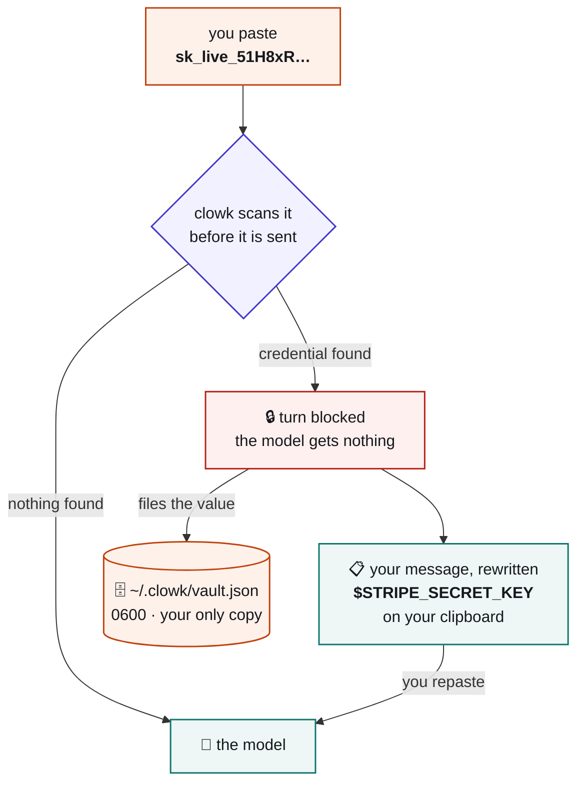
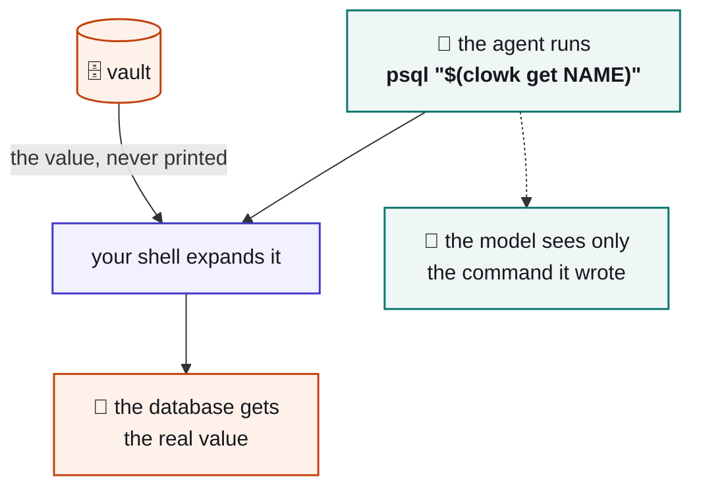
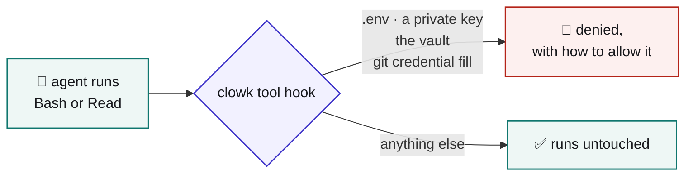
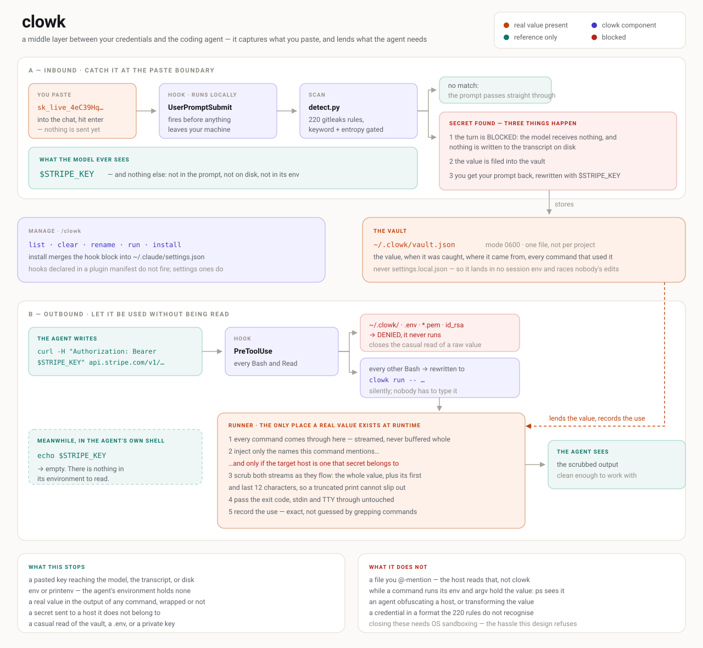

<div align="center">

<picture>
  <source media="(prefers-color-scheme: dark)" srcset="clowk-logo-dark.svg">
  
</picture>

# clowk

[](https://github.com/Aniumbott/clowk/actions/workflows/ci.yml)

</div>

### You just pasted a live API key into a chat box.

You know the feeling exactly. Your hand is already off Enter and your brain catches up half a second
late. It's gone — to the model, to whoever runs it, into a transcript on your disk. There is no
unsending it, and the only honest fix is to go and rotate the thing.

clowk gives you that half-second back.

```
👀 clowk caught a credential before it reached the model.

   💾  $STRIPE_SECRET_KEY

📋 Paste this — already on your clipboard:

   rotate this key for me: $STRIPE_SECRET_KEY

   [assistant: $NAME is a credential clowk holds. Never print it.
    Use $(clowk get NAME) — see the clowk skill.]

🤔 Not a credential? Resend starting with  unclowk
```

The turn never left your machine. The value is filed locally under a name, your message is rewritten
and already on the clipboard, and you can get back to the thought you were having.

Claude Code, Codex and Gemini CLI. Python 3.8+, standard library only. No network, no daemon,
nothing to sign up for.

## What actually happens



Orange is where a real credential exists. Teal is a reference worth nothing on its own. Two orange
boxes, and the model touches neither.

Why block instead of quietly swapping the value? Because no host can rewrite a prompt you already
submitted — checked on all three. A hook gets to say "no", and that is the entire toolkit. So the
flow is block-and-repaste, and the clipboard is what stops that being annoying.

Detection is 221 [gitleaks](https://github.com/gitleaks/gitleaks) rules plus three of clowk's own:
one for credential-shaped tokens standing alone, and one for each connection-string dialect. Paste
`postgresql://user:pw@host/db` and the **whole URI** is filed as `$DATABASE_URL`, so your hostname
and database name do not travel either. The same goes for the `key=value;` dialect every Microsoft
SDK and ODBC driver uses: an Azure storage string is filed whole as
`$AZURE_STORAGE_CONNECTION_STRING`, rather than having its `AccountKey` swapped while
`AccountName=prodstore` rides along. Placeholder passwords (`changeme`, `<your-account-key>`) and
things that are already references (`$DB_PASS`) are left alone.

At most 20 names per message. More hits than that is a pasted log, not a paste of credentials — the
rest are still redacted and the turn is still blocked, they just are not filed.

## Install

```bash
git clone https://github.com/Aniumbott/clowk.git
cd clowk
python3 clowk/cli.py install     # Claude Code — and writes the `clowk` command itself
```

Restart the agent. That first run also writes `~/.local/bin/clowk`, so from here on it is just:

```bash
clowk install codex          # Codex
clowk install gemini-cli     # Gemini CLI
clowk list                   # what is stored — names and metadata, never values
```

If `~/.local/bin` is not on your `PATH`, `install` says so and prints the line to add.

**Do not substitute a shell alias.** Aliases only exist in interactive shells, and the caller that
matters here is the non-interactive Bash your agent runs. There `$(clowk get NAME)` silently expands
to nothing, your command runs *without* the credential, and the error you get back looks like a bad
key rather than a missing tool.

`install` merges into your existing settings, backs them up first, and refuses a settings file that
is not valid UTF-8 JSON. `uninstall` removes only what clowk wrote, byte for byte. Launcher and
hooks both hold absolute paths to this clone and to the interpreter you ran `install` with, so
nothing depends on `PATH` — but move the clone and you re-run `install`.

On Windows use `python` or `py`; there is no `python3` on a stock install. On Codex, hooks need
trust: run `/hooks` and approve clowk. Trust is hash-based, so every update asks again.

<details>
<summary><code>/clowk</code> and the optional plugin install</summary>

`clowk install` writes `~/.claude/commands/clowk.md`, so `/clowk` works with no further steps. It
generates that file rather than copying `commands/clowk.md`, which resolves `${CLAUDE_PLUGIN_ROOT}`
— only set for plugin commands. A `/clowk` you wrote yourself is never overwritten.

It also copies the skill to `~/.claude/skills/clowk/`, so the agent knows what a `$NAME` is without
the plugin. That is only true from 0.3.0 on — before it, the plugin was the only thing delivering the
skill, and an agent without it read `$DATABASE_URL` as an ordinary empty variable and asked you to
paste the real one again. If that is why you installed the plugin, you no longer need it.

To install as a plugin anyway, inside Claude Code, with `<clone>` this directory's absolute path:

```
/plugin marketplace add <clone>
/plugin install clowk@clowk-dev
```

**Either source makes a second copy.** `/plugin install` caches the whole tree under
`~/.claude/plugins/cache/clowk-dev/clowk/<version>/`, pinned to the commit you installed at — local
path included, measured, not just a git URL. The cache key is `plugin.json`'s version, which does not
change when the source does, so `/clowk:clowk` runs that snapshot until you bump and refresh. Both
copies read the same vault, so nothing breaks at once; they drift. A git URL needs the `.git` suffix.

Plugin commands are always namespaced, hence `/clowk:clowk` — which is why `install` writes the
user-level file too. The plugin declares no hooks, so it cannot double-register anything.

</details>

## So how do you actually use the key afterwards?

Reasonable question, since the whole point was that nothing can read it. A captured value is **not**
in your agent's environment — `echo $DATABASE_URL` prints nothing, and that is deliberate. You
substitute it at the moment of use:

```bash
psql "$(clowk get DATABASE_URL)"
curl -H "Authorization: Bearer $(clowk get STRIPE_SECRET_KEY)" https://api.stripe.com/v1/charges
```



The shell hands the value straight to the command as an argument. Nothing wraps your command, so
your host's own permission rules still match what you actually ran.

**`clowk get` is the only thing that prints a credential, so it is guarded.** Any other use puts the
value in your transcript — the exact thing you installed this to avoid. The tool hook refuses a bare
`clowk get`, a substitution piped into `echo`/`cat`/`printf`, a redirect, and capture into a shell
variable. The guard lives in the hook rather than in `clowk get` because a process cannot tell
whether it was command-substituted. Measured, not assumed.

Your agent learns this from a skill `install` drops in `~/.claude/skills/`, pointed at from a
session's **first** block — so the rule arrives with the `$NAME` it governs, and is not paid for
twice.

Every `clowk get` is recorded, so `clowk uses` tells you where a credential was caught and what has
drawn on it since. Rotation stops being archaeology.

## Commands

```
clowk list                 stored credentials — names and metadata, never values
clowk add NAME             type a credential at the terminal instead of pasting it in chat
clowk get NAME             print one, for command substitution only
clowk set NAME             replace a value after rotating it upstream
clowk clear NAME           forget one
clowk rename OLD NEW       rename one
clowk uses [NAME]          where a credential was caught, and what has drawn on it
clowk allow PATTERN        stop denying one of clowk's rules — a filename, a suffix or a command
                           phrase, as the deny message prints it, not a full path
clowk deny PATTERN         undo an allow, putting the rule back
clowk install [HOST]       register clowk's hooks and write the launcher; uninstall removes both
```

`add` and `set` never take the value as an argument — that would put it straight in your shell
history, which rather defeats the exercise.

## The other hook, for when you are not the one pasting

Your agent can leak a credential without you touching the keyboard: it `cat`s a `.env`, or runs
`git credential fill`, and the value is in the transcript. A second hook denies the easy ones.



It denies *running* those, not mentioning them — a path in a commit message, an `echo`, or a grep
pattern all pass. A path only counts as a read when something that reads files is running it. The
`Read` tool's own path check needs no such heuristic and stays strict.

## The whole thing on one page

The three diagrams above are each one path through clowk. This is all of it at once, including the
parts with no flow to draw — the store, the ledger, the launcher, and what the design does and does
not cover.
Click through for full size; GitHub scales it to the column.

[](clowk-architecture.svg)

## What clowk will not save you from

Every tool in this corner of the world would like you to believe it is a wall. clowk is not one, so
here is the list of holes instead of making you go and find them.

**It is not a security boundary.** clowk runs as the same OS user as your agent, so whatever clowk
can read, `cat` can read. It stops accidents. It will not stop an agent that is genuinely trying.

- **Hook failure.** Every host fails open: if the hook crashes or times out, your prompt goes. clowk
  raises the bar, it cannot guarantee interception.
- **The transcript on disk.** Blocking stops the model, not the disk. Claude Code writes the blocked
  prompt to `~/.claude/projects/*.jsonl` itself, as a `system` record ending
  `Original prompt: <your text, credential and all>`. Measured, not assumed. **Treat a blocked paste
  as a key you still need to rotate.**
- **Files you `@`-mention.** The host reads those, not clowk.
- **Grep**, which shows file contents to the model. The deny hook is registered on `Bash` and `Read`
  only, so anything else that reads a file goes around it.
- **Unrecognised formats.** A shape none of the 224 rules knows goes straight through. A live
  example, measured: a Supabase `sbp_` token in prose. gitleaks has no Supabase rule at all, and
  clowk's standalone rule wants mixed case, which `sbp_` plus lowercase hex has not got. Write
  `SUPABASE_ACCESS_TOKEN=<it>` and it is caught; say "here is my supabase token" and it is not.
- **Hex-only secrets standing alone.** A 64-character hex string is a sha256 digest and a 256-bit
  HMAC secret at once, and nothing about the token separates them — reporting those would block
  `git show <sha>`. Put a keyword nearby (`webhook_secret = <hex>`) and they are caught, every time,
  at every key size from 128 bits up. A measured trade, not an oversight.
- **Hex secrets under 128 bits, most of the time, even with a keyword.** A 16-character hex value
  clears gitleaks' 3.5 entropy floor 9% of the time and nothing rescues the rest, because the
  symbol-count rule below applies only from 32 hex characters up. Dropping that length condition
  took 64-bit recall to 99.4% — and took a pasted 1800-line log from 168 hits to 1782, since a
  16-hex `auth_token_hint=` sits one keyword away from every log line anyone pastes. Redaction
  costs one pass per hit, so a 2 MB paste went from 3.2s to 46.0s against a 60s hook timeout, and
  past that timeout every host fails open. 64-bit keys are not worth that.
- **Partially matched credentials.** Only the span a rule matches gets replaced. If your credential
  is longer than the pattern that caught it, the tail stays in the rewrite while the block message
  still reports success. Overlapping rules are handled — longest match wins — but a format no rule
  covers in full is not.

A real boundary needs a separate OS user, a container with clowk outside it, or a code-signed binary
holding an OS keychain ACL. None of those is what this tool is.

## Where it puts things

`~/.clowk/vault.json`, mode 0600 on POSIX (Windows relies on user-profile ACLs). `CLOWK_VAULT` moves
it; `CLOWK_DENY` moves the deny hook's config.

**Plaintext, deliberately.** Encryption cannot help: clowk runs as the same user as the agent, so any
key would have to be reachable by that user — and so by the agent. Same posture as
`~/.aws/credentials`, `~/.npmrc` and an unencrypted `id_rsa`. The upside of plain JSON is that
reading the file *is* your export path; nothing here can lock you out of your own credentials.

Hand-edit it into invalid JSON and clowk refuses rather than guessing: every command prints the path
and stops. A capture during that window still blocks and still redacts — it just tells you the value
was not saved.

## It will sometimes be wrong

130 of the 221 rules match on shape rather than a literal vendor prefix, and clowk's standalone-token
rule matches on shape alone, so a perfectly innocent prompt can get blocked. (That count is
deliberately conservative: a pinned format with no trailing separator like `AKIA…` counts as
shape-only too, and only the value half of a rule counts.)

Hex of 32 characters or more may also block on how many of the 16 digits appear — 8 of them — and
not only on entropy, because an absolute entropy floor is calibrated for base64's 6.0-bit ceiling
and hex tops out at 4.0, which threw away 19% of genuine 128-bit keys. So a placeholder that walks
the whole alphabet (`1234567890abcdef` twice) blocks, while one that repeats a few digits
(`deadbeef` four times) does not. The walk already cleared the old floor at the maximum 4.0 bits,
so that is inherited, not new.

When it happens, resend starting with `unclowk`. Shape-only matches are flagged in `clowk list`, so
the junk is easy to spot and `clowk clear NAME` away.

## Hacking on it

No dependencies, so no setup step:

```bash
python3 -m unittest discover -s tests        # 399 tests, ~4s
```

CI runs the same suite on Python 3.8 through 3.13 across Linux, macOS and Windows, plus three checks
the suite cannot make itself: that no third-party import has crept in, that the prompt hook run end
to end leaks the raw value into neither stream on any host, and that install merges into a settings
file it did not write while uninstall restores it byte for byte. `tests/test_docs.py` checks this
README against the code, so a claim here that stops being true fails the suite.

The layout: `detect.py` scans, `vault.py` stores, `hosts.py` adapts each host's payload and block
protocol, `hook_prompt.py` is the pre-transmit guard, `hook_pretool.py` the tool deny, `deny.py` its
rules, `install.py` registers hooks, `cli.py` is the human surface. `DESIGN.md` explains why the
design is this shape and what was thrown away; `NOTES.md` records the per-host platform findings and
marks what is verified and what is not.

**Updating the ruleset.** `clowk/rules.json` is generated by `build_rules.py` from the vendored
`clowk/gitleaks.toml`. Re-running it alone reproduces a byte-identical file — to pick up new
patterns, replace the vendored copy with a newer one from
[gitleaks](https://github.com/gitleaks/gitleaks) first, then re-run. `build_rules.py` normalises
Go's regex dialect to Python's and prints what it translated and what it could not use; a rule it
cannot compile is skipped, and a test fails if that ever loses one. Check `NOTES.md` before
refreshing: it records, with dates, what upstream's newest config actually is — which is currently
the copy already vendored here.

**Adding a host** takes a `hosts.py` entry, an `install.py` target, and a verified answer to three
questions: what is the pre-transmit event called, can it block, and can it rewrite the prompt?
`clowk debug-payload` dumps what a host actually sends. Please do not add a host on inference —
`NOTES.md` marks what is verified and what is not, and that distinction is load-bearing.

## License

MIT — see `LICENSE`. Secret patterns derive from
[gitleaks](https://github.com/gitleaks/gitleaks) (MIT).
