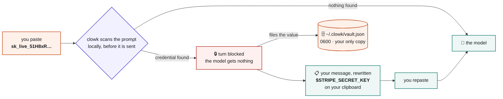
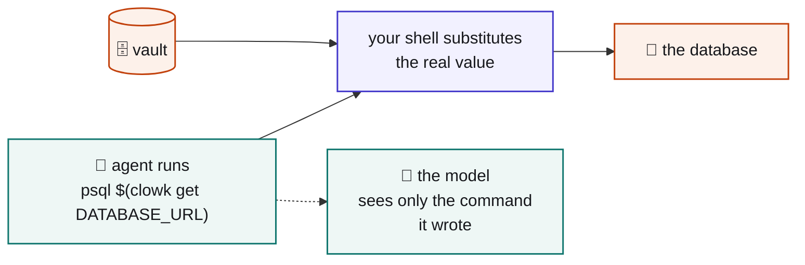
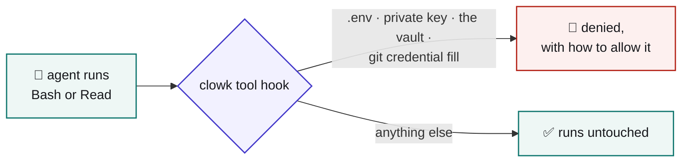

# clowk

[](https://github.com/Aniumbott/clowk/actions/workflows/ci.yml)

**You pasted an API key into your AI agent's chat. clowk catches it before the model sees it.**

The value is filed locally under a name. You get your message back with `$STRIPE_SECRET_KEY` where
the key was, already on your clipboard. Repaste and carry on.

Works with Claude Code, Codex and Gemini CLI. Python 3.8+, standard library only, no network.

## How it works



Orange is where a real credential exists. Teal is a reference only — `$STRIPE_SECRET_KEY` is worth
nothing on its own. There are two orange boxes, and the model touches neither.

Blocking is the whole mechanism. No host can rewrite a submitted prompt — verified on all three —
so there is no silent swap, only block-and-repaste. That is why the clipboard step matters.

### What you see

```
🔒 clowk caught a credential before it reached the model.

   💾  $STRIPE_SECRET_KEY

📋 Paste this — already on your clipboard:

   rotate this key for me: $STRIPE_SECRET_KEY

   [assistant: $NAME is a credential clowk holds. Never print it.
    Use $(clowk get NAME) — see the clowk skill.]

👀 Not a credential? Resend starting with  unclowk
```

Detection is 220 [gitleaks](https://github.com/gitleaks/gitleaks) rules plus one rule of clowk's
own for credential-shaped tokens standing alone, keyword- and entropy-gated. Shape-only guesses say
so, and `clowk clear NAME` undoes one.

Connection strings are handled whole: paste `postgresql://user:pw@host/db` and the entire URI is
filed as `$DATABASE_URL`, so the host and database name do not travel either. Placeholder passwords
(`password`, `changeme`) and values that are already references (`$DB_PASS`) are left alone.

One message is filed under at most 20 names. More hits than that is a pasted log tripping the
shape-only rules, not a credential paste — the rest are still redacted and the turn is still
blocked, they are just not filed.

## Install

```bash
git clone https://github.com/Aniumbott/clowk.git
cd clowk
python3 clowk/cli.py install              # Claude Code
python3 clowk/cli.py install codex        # Codex
python3 clowk/cli.py install gemini-cli   # Gemini CLI
```

Restart the agent. Then alias the CLI — there is no installed binary:

```bash
alias clowk='python3 ~/clowk/clowk/cli.py'
```

`install` merges into your existing settings, backs the file up first, and refuses to touch it if it
is not valid UTF-8 JSON. `uninstall` removes only clowk's own entries and leaves the rest exactly as
you wrote it, accented characters included.

The registered command holds this clone's absolute path and the absolute path of the interpreter you
ran `install` with — so nothing depends on a name being on `PATH`, but if you move the clone or
replace the interpreter, re-run `install`.

On Windows use `python` or `py`; there is no `python3` on a stock install. On Codex, hooks require
trust: run `/hooks` and approve clowk. Trust is hash-based, so every update asks again.

<details>
<summary><code>/clowk</code> and the optional plugin install</summary>

`clowk install` writes `~/.claude/commands/clowk.md`, so `/clowk` works with no further steps. It
generates that file rather than copying `commands/clowk.md`, which resolves `${CLAUDE_PLUGIN_ROOT}`
— only set for plugin commands. If you already have your own `/clowk`, clowk refuses to overwrite it
and says so.

To install as a plugin instead, inside Claude Code, with `<clone>` this directory's absolute path:

```
/plugin marketplace add <clone>
/plugin install clowk@clowk-dev
```

Point the marketplace at your clone, not at a git URL: a URL marketplace clones a second copy, so
`/clowk` would run different code from the hooks you just registered. Both read the same vault, so
nothing breaks immediately — but after you pull, the hooks are new and `/clowk` is still the
snapshot, and they can disagree. A URL also needs the `.git` suffix. A plugin command is always
namespaced, so the plugin's copy is `/clowk:clowk` — which is why `install` writes the user-level
file as well. The plugin declares no hooks of its own, so it cannot double-register anything.

</details>

## Using a captured credential

A captured value is **not** in your agent's environment — `echo $DATABASE_URL` prints nothing, and
that is the point. Substitute it at the point of use:

```bash
psql "$(clowk get DATABASE_URL)"
curl -H "Authorization: Bearer $(clowk get STRIPE_SECRET_KEY)" https://api.stripe.com/v1/charges
```



The shell captures the value and hands it to the command as an argument. Your command stays your
command — nothing wraps it, so the host's own permission rules still match what you actually ran.

**`clowk get` is the only command that prints a credential, and it is guarded.** Used any other way
the value lands in the transcript, so clowk's tool hook denies a bare `clowk get`, a substitution
fed to `echo`/`cat`/`printf`, a pipe, a redirect, and capture into a shell variable. The guard lives
in the hook rather than in `clowk get` because a process cannot tell whether it was
command-substituted — measured, not assumed.

`install` also copies `skills/clowk/SKILL.md` to `~/.claude/skills/`, and a session's **first** block
ends with a pointer to it, so the rule arrives in the same message as the `$NAME` it applies to.
Later blocks omit it: the agent has read the skill, and the pointer is pure cost once it has landed.
A host whose payload carries no session id gets it every time — omitting it costs more than
repeating it.

Every `clowk get` is recorded, so `clowk uses` tells you both where a credential was caught and what
has drawn on it since.

## Commands

```
clowk list                 stored credentials — names and metadata, never values
clowk add NAME             type a credential at the terminal instead of pasting it in chat
clowk get NAME             print one, for command substitution only
clowk set NAME             replace a value after rotating it upstream
clowk clear NAME           forget one
clowk rename OLD NEW       rename one
clowk uses [NAME]          where a credential was caught, and what has drawn on it
clowk allow PATTERN        stop denying one of clowk's rules — a filename, a suffix or a command
                           phrase, as the deny message prints it, not a full path
clowk deny PATTERN         undo an allow, putting the rule back
clowk install [HOST]       register clowk's hooks; uninstall removes them
```

`add` and `set` never take the value as an argument — that would put it in your shell history.

## The second hook

A separate hook denies the easy accidental reads. Cheap, real, and not a boundary.



It denies *running* those, not mentioning them — a path in a commit message, an `echo`, or a grep
pattern passes; a path only counts as a read when something that reads files is running it. The
`Read` tool's own path check needs no such heuristic and stays strict.

## What clowk is not

**clowk is not a security boundary.** It runs as the same OS user as the agent, so whatever clowk can
read, `cat` can read. It stops accidents. It does not stop an agent deliberately trying to extract a
value. Specifically, it does **not** protect against:

- **Hook failure.** Every host fails open: if the hook crashes or times out, your prompt is
  transmitted. clowk raises the bar; it cannot guarantee interception.
- **The transcript on disk.** Blocking stops the model, not the disk. Claude Code writes the blocked
  prompt to `~/.claude/projects/*.jsonl` itself, as a `system` record ending
  `Original prompt: <your text, credential and all>`. Measured, not assumed. Treat a blocked paste as
  a credential you should still rotate.
- **Files you `@`-mention.** The host reads those, not clowk.
- **Grep**, which shows file contents to the model. The deny hook is registered on `Bash` and `Read`
  only, so anything else that reads a file goes around it.
- **Unrecognised formats.** A shape none of the 221 rules knows goes straight through.
- **Hex-only secrets with no keyword near them.** A 64-character hex string is a sha256 digest and a
  256-bit HMAC secret at the same time; nothing about the token separates them. Reporting them
  standing alone would block `git show <sha>`, so clowk does not. With a keyword nearby
  (`webhook_secret = <hex>`) they are caught. A measured trade, not an oversight.
- **128-bit hex secrets, about 18% of the time, even with a keyword.** Hex has 16 symbols, so a
  32-character hex string caps out at 4.0 bits of entropy against the 3.5 floor gitleaks sets for its
  generic rule; over 2000 samples, 17.8% fall under it. The floor stays at gitleaks' value rather
  than being re-tuned for one key size. 256-bit hex and larger are unaffected.
- **Partially matched credentials.** A rule matches a span, and only that span is replaced. If your
  credential is longer than the pattern that caught it, the remainder stays in the rewrite while the
  block message still says clowk stopped a credential. Overlapping rules are handled — the longest
  match wins, so a short rule cannot leave the tail of a longer key behind — but a format no rule
  covers in full is not.

A real boundary needs a separate OS user, a container with clowk outside it, or a code-signed binary
holding an OS keychain ACL. None of those is what this tool is.

## Storage

`~/.clowk/vault.json`, mode 0600 on POSIX (on Windows it relies on user-profile ACLs). `CLOWK_VAULT`
moves it; `CLOWK_DENY` moves the deny hook's config.

**Plaintext, deliberately.** Encryption cannot help here: clowk runs as the same user as the agent,
so any key would have to be reachable by that same user. Same posture as `~/.aws/credentials`,
`~/.npmrc` and an unencrypted `id_rsa`. Because it is plain JSON, reading it is also your export and
backup path — there is nothing to lock you out of your own credentials.

If a hand-edit leaves the file unparseable, clowk refuses rather than guessing: every command prints
the path and stops, and nothing is overwritten. A capture during that window still blocks the turn
and still redacts the value — it just tells you the value was not saved.

## False positives

129 of the 220 rules match on shape rather than a literal vendor prefix, and clowk's own
standalone-token rule matches on shape alone, so a legitimate prompt can be blocked. (That count is
deliberately conservative: a pinned format with no trailing separator like `AKIA…` counts as
shape-only too, and only the value half of a rule counts.) Every block says how to bypass
(`unclowk`), and shape-only matches are flagged in `clowk list` so they are easy to purge.

## Development

No dependencies, so no setup step:

```bash
python3 -m unittest discover -s tests        # 340 tests, ~2s
```

CI runs the same suite on Python 3.8 through 3.13 across Linux, macOS and Windows, plus three checks
the suite cannot make on its own: that no third-party import has crept in, that the prompt hook run
end to end leaks the raw value into neither stream on any of the three hosts, and that install merges
into a settings file it did not write and uninstall restores it byte for byte.
`tests/test_docs.py` checks this README against the code, so a claim here that stops being true
fails the suite.

The layout: `detect.py` scans, `vault.py` stores, `hosts.py` adapts each host's payload and block
protocol, `hook_prompt.py` is the pre-transmit guard, `hook_pretool.py` the tool deny, `deny.py` its
rules, `install.py` registers hooks, `cli.py` is the human surface. `DESIGN.md` explains why the
design is this shape and what was tried and removed; `NOTES.md` records the per-host platform
findings and marks what is verified and what is not.

**Updating the ruleset.** `clowk/rules.json` is generated by `build_rules.py` from the vendored
`clowk/gitleaks.toml`. Re-running it alone reproduces a byte-identical file — to pick up new
patterns, replace the vendored copy with a newer one from
[gitleaks](https://github.com/gitleaks/gitleaks) first, then re-run.

**Adding a host** takes a `hosts.py` entry, an `install.py` target, and a verified answer to: what is
the pre-transmit event called, can it block, and can it rewrite the prompt? `clowk debug-payload`
dumps what a host actually sends. Please do not add a host on inference — `NOTES.md` marks what is
verified and what is not, and that distinction is load-bearing.

## License

MIT — see `LICENSE`. Secret patterns derive from
[gitleaks](https://github.com/gitleaks/gitleaks) (MIT).
